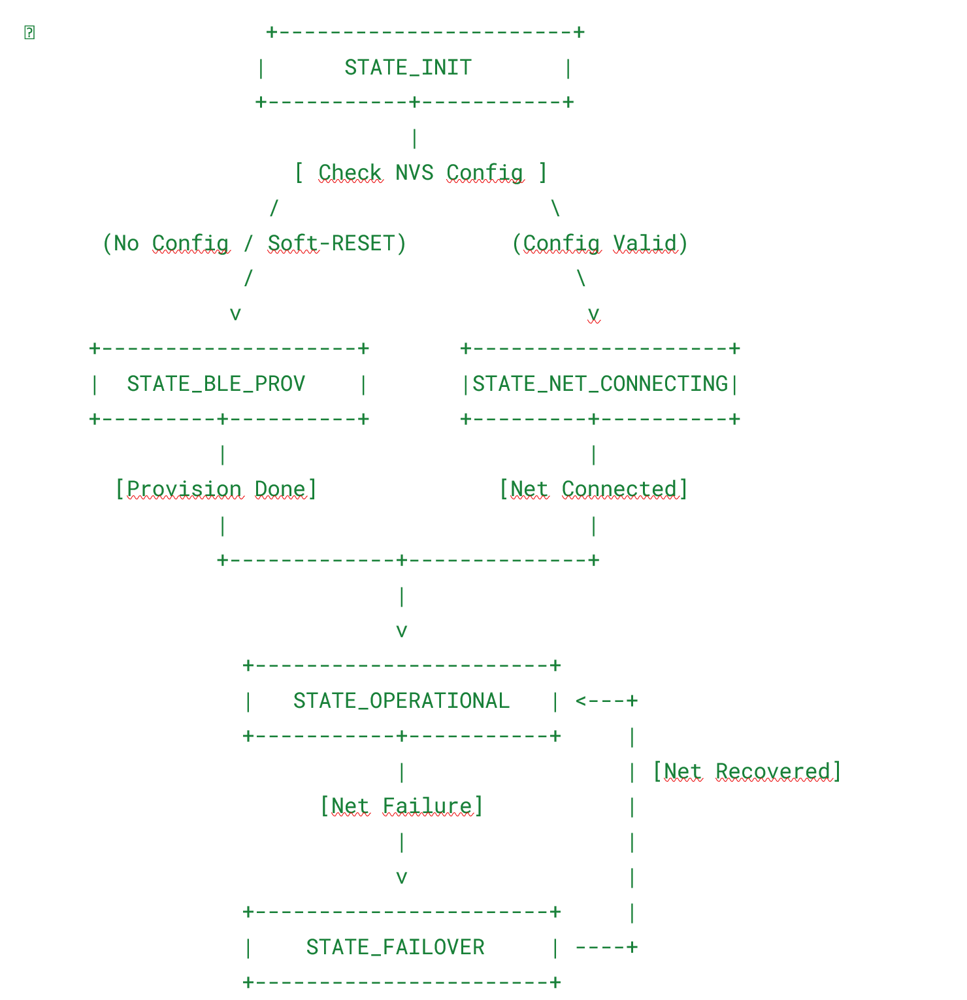

Requirements & System Architecture Specification: Aquaculture pond monitoring controller - ESP32-S3 Controller

# 1. Primary Goals

Deterministic High Reliability: Vận hành liên tục 24/7 trong môi trường công nghiệp, tự khôi phục sau sự cố mạng/cảm biến/sụt áp mà không treo vi điều khiển.
Seamless Integration: Cung cấp giao thức truyền nhận JSON chuẩn hóa qua MQTT (Telemetry/Command/Ack) giúp các hệ thống dễ dàng phân tích và hạ lệnh điều khiển.
Network Redundancy & Zero-Downtime Switching: Đảm bảo đường truyền luôn thông suốt với cơ chế Failover/Failback tự động giữa Ethernet SPI (W5500) và Wi-Fi Station.
BLE Provisioning & Mobile App Lifecycle Control: Cho phép BLE Provisioning cấu hình Wi-Fi và MQTT. Sau khi kết nối, mọi cấu hình, thay đổi, thêm/xóa/sửa tên cảm biến, điều khiển tải, hiển thị dữ liệu và xem lỗi hệ thống đều có thể thực hiện trực tiếp qua App di động (hoặc qua BLE / MQTT).
System Context & Interface MappingAI Self-Coding Optimization: Tất cả Data Structures, State Machines, Input/Output Control, Module Responsibilities, Message Schemas, Task Entry Logics và Design Rules được định nghĩa ở mức cực kỳ chi tiết (C Structs / FreeRTOS Queues / Standardized Interfaces) để các công cụ AI Codegen (GitHub Copilot, Claude, GPT-4) có thể tự động sinh code ESP-IDF v5.x hoàn chỉnh không bị lỗi kiến trúc.

Native USB Firmware Update & DFU: Hỗ trợ nạp code trực tiếp thông qua cổng Native USB (USB-Serial/JTAG Controller tích hợp trên ESP32-S3) tiện lợi cho việc bảo trì thực tế.
Secure Boot V2 & Flash Encryption (Chip Locking): Kích hoạt cơ chế khóa chip bảo mật cao cấp của ESP32-S3. Chỉ cho phép nạp và chạy các image firmware có metadata và digital signature hợp lệ được ký mã hóa riêng cho board; vô hiệu hóa hoàn toàn việc đọc trộm firmware từ flash hoặc nạp các mã độc chưa được verify.
# 2. System Context & Interface Mapping

+-----------------------------------------------------------------------------------+

| MOBILE APP |

| (BLE Protocomm Custom Endpoints / MQTT Telemetry & Command Topics) |

+----------------------------------------+------------------------------------------+

|

v

+-----------------------------------------------------------------------------------+

| ESP32-S3-WROOM-1U MCU |

| |

| [ CORE 0: Network & Connectivity ] | [ CORE 1: Sensing, Control & System ] |

| - app_network (ETH W5500 / Wi-Fi) | - app_modbus (RS485 Polling Engine) |

| - app_mqtt (Client / Sub / Pub) | - app_control (Relay / Safety Interlock)|

| - app_ble_prov (Config / Full Control)| - app_sysmon (WDT / Memory / Error Blink)|

| - Native USB (DFU & Serial/JTAG) | - app_nvm (NVS Read/Write/Reset) |

+-------------------+---------------------+--------------------+--------------------+

| |

v v

+---------------------------------------+ +----------------------------------------+

| HARDWARE NETWORKS | | HARDWARE PERIPHERALS |

| - W5500 Ethernet SPI (SCK, MOSI, | | - RS485 Transceiver (DE/RE, TX, RX) |

| MISO, CS, INT, RST) | | + SHT40 (Temp/Humidity) |

| - Wi-Fi 802.11 b/g/n (U.FL Antenna) | | + Dissolved Oxygen (DO - Reg 0x0002)|

| - Native USB (GPIO 19/20 - D-/D+) | | + pH Sensor (Reg 0x0000) |

| | | - Relay Outputs (GPIO Control) |

| | | - Status LEDs (WiFi, ETH, Load, Err) |

| | | - Soft-RESET Push Button (GPIO Input) |

+---------------------------------------+ +----------------------------------------+

# 3. Detailed Module Specification (File-by-File Functions)

Hệ thống được chia thành 7 components độc lập trong kiến trúc ESP-IDF, mỗi component chịu trách nhiệm rõ ràng về Input, Output và API công khai:
## 3.1 main (Application Entry Point)

Mục đích: Điểm khởi chạy chính của chương trình, tạo các tài nguyên dùng chung (FreeRTOS Mutexes, Event Groups, Queues) và ghim Task vào từng Core.
Files:
`main/main.c`: Khởi tạo NVS, gọi hàm init của từng module, tạo các FreeRTOS Tasks pinned to cores.
`main/main_data_types.h`: Chứa toàn bộ Data Structures, Enums, Bitmask Lỗi và Queue Handles dùng chung toàn hệ thống.
## 3.2 app_network (Network & Failover Management)

Mục đích: Quản lý song song Ethernet SPI (W5500) và Wi-Fi Station, thực hiện tự động chuyển đổi đường truyền khi gặp sự cố.
Failover Logic: Chu kỳ Ping 2 giây. Nếu cáp ETH mất tín hiệu (< 1s), tự đổi default netif sang Wi-Fi nhưng hệ thống vẫn ở trạng thái OPERATIONAL. Chỉ khi mất cả ETH và Wi-Fi (hoặc mất Ping gateway cả hai đường) mới kích hoạt Event SYS_ERR_NET_LOST và chuyển sang STATE_OFFLINE.
Files:
`components/app_network`/include/app_network.h: Khai báo API kết nối, chuyển đổi interface và getter trạng thái mạng.
`components/app_network`/app_network.c: Implement driver W5500, Wi-Fi STA, Event Loop Handler và Ping Task check Internet.
Chức năng chính:
1. Khởi tạo SPI Master Driver kết nối chip W5500.
2. Khởi tạo Wi-Fi Station stack với credentials từ NVM.
3. Kích hoạt Failover Logic: Ưu tiên Ethernet, khi Ethernet Down tự chuyển Route Default sang Wi-Fi, khi Ethernet UP tự quay về Ethernet.
## 3.3 app_mqtt (MQTT Communication & Command Gateway)

Mục đích: Quản lý MQTT Client, gửi Telemetry, gửi phản hồi (ACK), nhận lệnh điều khiển Tải và nhận cấu hình thay đổi từ app. QoS 1 cho Command/ACK, QoS 0 cho Telemetry.
Files:
`components/app_mqtt`/include/app_mqtt.h: Khai báo API khởi chạy MQTT Client, publish telemetry/status.
`components/app_mqtt`/app_mqtt.c: Implement esp-mqtt, parse JSON command qua cJSON, xử lý reconnect backoff.
Chức năng chính:
1. Duy trì kết nối MQTT Client an toàn (TCP/TLS). Duy trì mqtt_client_task. Nếu mất Broker, kích hoạt Event SYS_ERR_MQTT_BROKER.

2. Subscribe các topic: v1/devices/me/commands, v1/devices/me/config/set.
3. Publish dữ liệu cảm biến định kỳ lên v1/devices/me/telemetry.
4. Parse lệnh nhận được và đẩy thông điệp vào `load_cmd_queue` hoặc `config_cmd_queue`.
## 3.4 app_modbus (RS485 Modbus RTU Polling Engine)

Mục đích: Đọc dữ liệu từ các cảm biến công nghiệp qua giao thức Modbus RTU RS485 và cho phép tùy biến thông số cảm biến.
Files:
`components/app_modbus`/include/app_modbus.h: Định nghĩa hàm Polling Modbus, API đổi ID/Slave Config.
`components/app_modbus`/app_modbus.c: Driver UART RS485, tính toán CRC16, đọc/ghi Holding Registers.
Chức năng chính:
1. Điều khiển chân DE/RE của RS485 Transceiver khi đọc/ghi UART.
2. Lần lượt đọc 3 cảm biến: SHT40 (Temp/Humid), Oxy hòa tan (DO), pH.
3. Cho phép thay đổi Slave ID, Name, Baudrate hoặc Bật/Tắt (Enable/Disable) từng cảm biến thông qua App/MQTT.
4. Xử lý Retry tối đa 3 lần nếu bít CRC lỗi hoặc Timeout.
## 3.5 app_control (Actuator & Relay Management)

Mục đích: Điều khiển bật/tắt 4 đầu ra GPIO Tải (Relays/SSRs) và quản lý cơ chế bảo vệ an toàn (Safety Interlock).
Files:
`components/app_control`/include/app_control.h: API điều khiển Relay, cài đặt Timer tự ngắt.
`components/app_control`/app_control.c: Driver GPIO Output, FreeRTOS Software Timers cho từng Tải.
Chức năng chính:
1. Nhận lệnh từ `load_cmd_queue` để đóng/ngắt GPIO Tải.
2. Quản lý timer đếm lùi tự động tắt Tải (Pulse Control / Duration).
Kích hoạt Safety Interlock: Tự động ngắt toàn bộ Tải về trạng thái an toàn nếu mất kết nối MQTT, SYS_ERR_MQTT_BROKER hoặc SYS_ERR_NET_LOST quá thời gian quy định (ví dụ 300s). Khi phục hồi mạng, Tải không tự bật lại mà đợi lệnh mới từ MQTT.

## 3.6 app_ble_prov (BLE Provisioning & App Config Management)

Mục đích: Kích hoạt BLE Protocomm Service cho phép App di động quét Wi-Fi, cài đặt Wi-Fi/MQTT và thực hiện đầy đủ các chức năng quản trị trực tiếp qua BLE. Chỉ chạy ở `STATE_BLE_PROV`. Sử dụng NimBLE, Security sec1. Đóng kết nối và dừng dịch vụ BLE hoàn toàn sau khi nhận đủ thông tin Wi-Fi và MQTT để chuyển qua `STATE_NET_CONNECTING`.
Files:
`components/app_ble_prov`/include/app_ble_prov.h: Khai báo API kích hoạt/dừng BLE Service.
`components/app_ble_prov`/app_ble_prov.c: Handlers cho Custom Endpoints của Protocomm (prov-config, sensor-config, load-ctrl, sys-status).
Chức năng chính:
1. Cung cấp Endpoint prov-config: Nhận Wi-Fi Credentials & MQTT Broker URL/Port/Token.
## 3.7 app_nvm (Non-Volatile Storage Management)

Mục đích: Lưu trữ và đọc an toàn các thông số cấu hình hệ thống vào Flash (NVS) và xử lý Nút bấm Factory Reset. NVS dùng namespace 'app_cfg', versioning CRC32 để hỗ trợ migration.
Files:
`components/app_nvm`/include/app_nvm.h: API đọc/ghi Struct Cấu hình (app_config_t), Reset Flash.
`components/app_nvm`/app_nvm.c: Thư viện nvs_flash, xử lý Debounce và nhấn giữ 10s Soft-RESET Button.
Chức năng chính:
1. Đọc/Ghi toàn bộ cấu hình mạng, MQTT, cấu hình cảm biến và tên Tải vào NVS Flash.
2. Giám sát chân GPIO Nút Reset: Giữ > 10 giây -> Xóa toàn bộ NVM -> Reboot thiết bị về chế độ BLE Provisioning.
Nút RESET:
- 0 - 10s: Không tác dụng (Debounce/Bỏ qua).
- \>= 10s: Xóa NVS, nháy LED dồn dập, Reboot thiết bị về `STATE_BLE_PROV`.
## 3.8 app_sysmon (System Diagnostics, Watchdog & LED Engine)

Mục đích: Giám sát sức khỏe vi điều khiển, quản lý Task Watchdog (TWDT) và điều khiển LED hiển thị trạng thái / báo lỗi. TWDT: Kích hoạt 10s. Đăng ký các task: sensor_modbus_task, net_mgmt_task, mqtt_client_task, và load_control_task. LED_ERROR Ưu tiên hiển thị: Lỗi NVS/Fatal (Sáng liên tục) > Lỗi Modbus (Nháy 4Hz) > Lỗi Net/MQTT (Nháy 1Hz). Tích hợp ESP-IDF Brownout Detector (tự reboot khi sụt áp).

Files:
`components/app_sysmon`/include/app_sysmon.h: API cập nhật Error Mask, đăng ký WDT, điều khiển LED.
`components/app_sysmon`/app_sysmon.c: Implement FreeRTOS Software Timer nhấp nháy LED, Task Watchdog Timer, kiểm tra Free Heap.
Chức năng chính:
1. Đăng ký các task hệ thống vào Task Watchdog Timer (TWDT).
2. Hiển thị trạng thái LED:
LED_WIFI: Tắt (Chưa kết nối/Đang dùng ETH), Nhấp nháy (Đang nối), Sáng (Đã nối & active).
LED_ETH: Tắt (Mất cáp/Đang dùng Wi-Fi), Nhấp nháy (Đang nối), Sáng (Đã nối & active).
LED_LOAD: Sáng khi có ít nhất tải tương ứng đang Bật.
LED_ERROR: Tắt (Bình thường), Nháy 1Hz (Mất Mạng/MQTT), Nháy 4Hz (Lỗi Cảm biến Modbus), Sáng liên tục (Lỗi Fatal/NVM).

# 4. Complete C Data Structures & Bitmasks

File ``main/main_data_types.h`` định nghĩa toàn bộ kiểu dữ liệu chuẩn cho AI Auto-Coding:
#ifndef MAIN_DATA_TYPES_H
#define MAIN_DATA_TYPES_H

#include <stdint.h>
#include <stdbool.h>

// 1. Trạng thái giao diện Mạng
typedef enum {
NET_IF_NONE = 0,
NET_IF_ETH,
NET_IF_WIFI
} net_interface_t;

// 2. Bitmask Mã Lỗi Hệ Thống
typedef enum {
SYS_ERR_NONE = 0,
SYS_ERR_MODBUS_TIMEOUT = (1 << 0), // Lỗi giao tiếp Modbus RS485
SYS_ERR_NET_LOST = (1 << 1), // Mất kết nối Mạng (cả ETH & WiFi)
SYS_ERR_MQTT_BROKER = (1 << 2), // Mất kết nối MQTT Broker
SYS_ERR_NVM_FAIL = (1 << 3), // Lỗi đọc/ghi Flash NVM
SYS_ERR_SENSOR_OUT_RANGE = (1 << 4) // Dữ liệu cảm biến ngoài ngưỡng an toàn
} sys_error_code_t;

// 3. Cấu hình Chi tiết cho từng Cảm biến Modbus
typedef struct {
uint8_t slave_id; // Địa chỉ Modbus Slave ID (1-247)
char name[32]; // Tên gợi nhớ Cảm biến (cho phép sửa qua App)
bool enabled; // Trạng thái Bật/Tắt đọc cảm biến này
float calib_offset; // Giá trị bù hiệu chuẩn (Calibration Offset)
} modbus_sensor_cfg_t;

// 4. Cấu hình Tổng thể Lưu trữ trong NVM (NVS Flash)
typedef struct {
// WiFi & Network Config
char wifi_ssid[32];
char wifi_password[64];

// MQTT Config
char mqtt_broker_url[128];
uint16_t mqtt_port;
char mqtt_client_id[32];
char mqtt_username[32];
char mqtt_password[64];

// Modbus Sensors Config
modbus_sensor_cfg_t sht40_cfg;
modbus_sensor_cfg_t do_cfg;
modbus_sensor_cfg_t ph_cfg;

// Actuators / Loads Config
char load_1_name[32]; // Tên gọi gợi nhớ của Tải (cho phép sửa qua App)
uint32_t safety_timeout_s;// Thời gian ngắt tải an toàn khi mất mạng (giây)
} app_config_t;

// 5. Structure Dữ liệu Cảm biến Thu thập Thời gian thực
typedef struct {
float temperature;
float humidity;
bool sht40_valid;

float do_mg_l;
bool do_valid;

float ph_val;
bool ph_valid;

int64_t timestamp;
} sensor_data_t;

// 6. Structure Lệnh Điều khiển Tải (từ MQTT / App)
typedef struct {
char cmd_id[36]; // UUID Lệnh
uint8_t load_id; // ID Tải (1, 2, ...)
bool target_state; // true = BẬT, false = TẮT
uint32_t duration_sec; // Thời gian đếm lùi tự động tắt (0 = vĩnh viễn)
} load_command_t;

// 7. Structure Cập nhật Cấu hình (từ App BLE / MQTT)
typedef struct {
enum {
CFG_CMD_UPDATE_WIFI_MQTT,
CFG_CMD_UPDATE_SENSOR,
CFG_CMD_UPDATE_LOAD_NAME
} type;
union {
struct {
char ssid[32];
char pass[64];
char mqtt_url[128];
uint16_t mqtt_port;
} net_info;
struct {
uint8_t sensor_type; // 0: SHT40, 1: DO, 2: pH
uint8_t new_slave_id;
char new_name[32];
bool enabled;
float calib_offset;
} sensor_info;
struct {
uint8_t load_id;
char new_name[32];
} load_info;
} payload;
} config_update_cmd_t;

#endif

# 5. State & Event Model (Inputs, Outputs & Transitions)

Chi tiết Input / Output của từng State:
### Table 1

| State (Trạng thái) | Input Triggers (Đầu vào) | Action & Output Logic (Xử lý & Đầu ra) | Next State Transition (Chuyển trạng thái) |
| --- | --- | --- | --- |
| `STATE_INIT` | System Power On / Reset | Khởi tạo Hardware: GPIO, NVS, UART RS485, SPI. Đọc app_config_t từ NVS. | - NVS rỗng/Lỗi: -> `STATE_BLE_PROV`
- NVS có cấu hình: -> `STATE_NET_CONNECTING` |
| `STATE_BLE_PROV` | Chuyển từ INIT hoặc Nhấn giữ Nút Soft-RESET 10 giây | Bật BLE Advertising. Mở 4 Custom Endpoints (Cấu hình Wi-Fi/MQTT). | Nhận đủ Wi-Fi/MQTT Config từ App -> Lưu NVS -> Tắt BLE -> `STATE_NET_CONNECTING`. |
| `STATE_NET_CONNECTING` | Khởi động xong hoặc vừa Provisioning thành công | Kích hoạt Ethernet SPI W5500. Sau 10 giây nếu không có cáp Mạng -> Thử kết nối Wi-Fi Station. LED_ETH/LED_WIFI nhấp nháy. | Nhận IP & Kết nối thành công MQTT Broker -> `STATE_OPERATIONAL`. |
| `STATE_OPERATIONAL` | Đã kết nối Mạng + MQTT | Core 0: Gửi Telemetry, nhận Command/Config.
Core 1: Đọc Modbus RS485, cập nhật Tải, Giám sát Health, cho phép App Config truy cập song song. | Mất kết nối Mạng (cả ETH & Wi-Fi) -> `STATE_FAILOVER`. |
| `STATE_FAILOVER` | Ethernet đứt cáp / Mất Wi-Fi / Mất Ping Gateway | Tự động đổi Route mặc định từ Ethernet -> Wi-Fi (hoặc ngược lại). LED_ERROR nhấp nháy 1Hz. Nếu mất kết nối > 300s -> Ngắt toàn bộ Tải (Safety Interlock). | - Kết nối khôi phục -> `STATE_OPERATIONAL`
- Nhấn giữ Soft-RESET 10s -> `STATE_FACTORY_RESET` |
| Any State | Nút Soft-RESET bị giữ liên tục 10 giây | LED_ERROR nháy dồn dập (10Hz). Gọi nvs_flash_erase(). Khởi động lại vi điều khiển. | Reboot -> `STATE_INIT` -> `STATE_BLE_PROV`. |

# 6. Deep-Dive Task Logics & Inter-Task Communications

## 6.1 Diagram Truyền Nhận Dữ Liệu giữa các Task (Inter-Task Queues)

 [ sensor_modbus_task ] ----(`sensor_data_queue`)----> [ mqtt_client_task ] ----> (MQTT Telemetry)
|
[ App Endpoints ] ----(`config_cmd_queue`)-----> [ app_nvm / Tasks ]
| |
+------------------(`load_cmd_queue`)-------> [ load_control_task ] ----> (GPIO Relays)
^
[ mqtt_client_task ] ----(`load_cmd_queue`)-----------------+

- sensor_modbus_task (Core 1, Priority 5, Stack 4096): Vòng lặp đọc 4 cảm biến.
- load_control_task (Core 1, Priority 7, Stack 3072): Nhận lệnh điều khiển.
- net_mgmt_task (Core 0, Priority 6, Stack 4096): Xử lý Failover ETH/WiFi.
- mqtt_client_task (Core 0, Priority 5, Stack 6144): Sub/Pub MQTT.
## 6.2 Chi tiết Logic Thực Thi của Các Task Chính

sensor_modbus_task (Core 1, Priority 5):
Lock modbus_uart_mutex.
Kiểm tra sht40_cfg.enabled: Nếu True -> Gửi Frame Modbus Read Holding Registers (Func 03) tới slave_id. Đợi phản hồi UART timeout 200ms. Tính toán CRC16.
Kiểm tra do_cfg.enabled: Đọc Cảm biến Oxy hòa tan. Áp dụng calib_offset.
Kiểm tra ph_cfg.enabled: Đọc Cảm biến pH. Áp dụng calib_offset.
Unlock modbus_uart_mutex.
Nếu 1 cảm biến bị lỗi đọc quá 3 lần liên tiếp -> Đánh dấu valid = false, bật bit SYS_ERR_MODBUS_TIMEOUT trong sys_error_mask.
Đẩy sensor_data_t vào `sensor_data_queue`.
Gọi vTaskDelay(pdMS_TO_TICKS(2000)).
load_control_task (Core 1, Priority 7):
Đợi thông điệp load_command_t từ `load_cmd_queue` (Timeout 100ms).
Khi nhận lệnh từ Queue (từ MQTT App):
Cập nhật chân GPIO Relay tương ứng.
Nếu duration_sec = 0: Không bao giờ ngắt Tải. Nếu duration_sec > 0: khởi chạy timer tự đôngj ngắt tải khi hết thời gian
Tạo thông điệp ACK gửi lại cho MQTT Task / BLE Client.
Kiểm tra Safety Interlock: Nếu bit SYS_ERR_NET_LOST bị set kéo dài quá safety_timeout_s -> Ép toàn bộ GPIO Tải về LOW (Tắt an toàn).
net_mgmt_task & Failover Engine (Core 0, Priority 5):
Lấy trạng thái Link của PHY Ethernet W5500.
Nếu Ethernet Cable Connected:
Thiết lập Ethernet làm Default Network Interface (esp_netif_set_default_netif).
Tắt Wi-Fi Station (hoặc đưa về Standby).
Cập nhật BIT_NET_ETH_CONNECTED trong sys_event_group.
Nếu Ethernet Cable Disconnected:
Kích hoạt esp_wifi_connect().
Khi Wi-Fi lấy được IP -> Thiết lập Wi-Fi làm Default Network Interface.
Cập nhật BIT_NET_WIFI_CONNECTED.
Chu kỳ Ping Gateway/Broker mỗi 5 giây. Nếu cả 2 Interface đều không Ping được -> Xóa hết Event Bits, set bit SYS_ERR_NET_LOST.

# 7. BLE Provisioning & Full Mobile App Management Specification

Mobile App tương tác với ESP32-S3 qua ESP-IDF Protocomm BLE Framework (Prefix Service Name: PROV_ESP32_) với 4 Custom Endpoints chuẩn hóa qua JSON:
+-----------------------------------------------------------------------------------+
| MOBILE APP BLE ENDPOINTS |
+-------------------+--------------------+--------------------+---------------------+
| prov-config | sensor-config | load-ctrl | sys-status |
| (SSID, Password, | (Slave ID, Name, | (Direct Control | (Realtime Data, |
| MQTT Broker) | Calib, Enable) | Relay On/Off) | Active Errors) |
+-------------------+--------------------+--------------------+---------------------+

- Telemetry: v1/devices/me/telemetry
- Command Rx: v1/devices/me/commands
- ACK Tx: v1/devices/me/ack
- Config Set: v1/devices/me/config/set
- Status: v1/devices/me/status
## 1. Endpoint prov-config (Cấu hình Mạng & MQTT initial)

Gửi từ App (JSON Write):
{
"wifi_ssid": "Factory_AP_01",
"wifi_pass": "SecretKey123",
"mqtt_url": "mqtt://broker.hivemq.com",
"mqtt_port": 1883
}
Phản hồi từ ESP32-S3: Save NVS -> Trả về {"status": "SUCCESS"} -> Reboot sau 2 giây.
## 2. Endpoint sensor-config (Đổi tên, Thêm/Xóa/Sửa Cảm biến qua App)

Gửi từ App (JSON Write):
{
"sensor_type": "ph",
"slave_id": 3,
"name": "pH_Tank_A1",
"enabled": true,
"calib_offset": -0.15
}
Xử lý trên ESP32-S3: Cập nhật struct ph_cfg trong RAM, gọi app_nvm_write_config(), gửi thông điệp reload cho sensor_modbus_task.
## 3. Endpoint load-ctrl (Đổi tên & Điều khiển Bật/Tắt Tải qua App)

Gửi từ App (JSON Write):
{
"action": "SET_STATE",
"load_id": 1,
"state": true,
"duration_sec": 60,
"new_name": "Pump_Water_A"
}
Xử lý trên ESP32-S3: Đẩy load_command_t vào `load_cmd_queue`, cập nhật tên Tải trong NVS.
## 4. Endpoint sys-status (Đọc Dữ liệu Thời gian thực & Danh sách Lỗi qua App)

Yêu cầu từ App (Read Request).
Phản hồi từ ESP32-S3 (JSON Response):
{
"net_interface": "ETH",
"sensors": {
"sht40": {"name": "Temp_Humid_Room", "temp": 29.1, "humid": 68.4, "valid": true},
"do": {"name": "DO_Tank_1", "do_mg_l": 6.82, "valid": true},
"ph": {"name": "pH_Tank_A1", "ph_val": 7.15, "valid": true}
},
"loads": {
"load_1": {"name": "Pump_Water_A", "state": true}
},
"errors": {
"code_mask": 1,
"messages": ["SYS_ERR_MODBUS_TIMEOUT on pH Sensor"]
}
}

# 8. Cấu hình Giao tiếp Phần cứng & Bảo mật (Secure Boot & Native USB)

## 1. Giao tiếp Ethernet W5500 (SPI Interface):

Sử dụng ESP-IDF SPI Master Driver kết nối với chip điều khiển mạng W5500 qua các đường chân phần cứng chuẩn: SPI2_HOST (FSPI), bao gồm SCLK, MOSI, MISO, chân chọn thiết bị CS, chân ngắt phần cứng INT, và chân phần cứng RST để khôi phục cứng khi W5500 treo cứng.
## Nạp Firmware qua Native USB & Chống khóa Chip (Security):

Native USB DFU/Serial-JTAG: Cấu hình chân GPIO 19 (D-) và GPIO 20 (D+) trực tiếp nối ra cổng USB Type-C/Micro của mạch. Cho phép lập trình viên nạp firmware (idf.py flash) trực tiếp bằng cổng Native USB tích hợp trên chip ESP32-S3 mà không cần qua chip chuyển đổi UART ngoài (như CH340 hay CP2102) và không cần thao tác bấm giữ nút BOOT cơ học.

Secure Boot V2 & Flash Encryption: Khi đóng gói sản phẩm thương mại, thực hiện bật cấu hình CONFIG_SECURE_BOOT_V2_ENABLED và CONFIG_SECURE_FLASH_ENC_ENABLED trong menuconfig của ESP-IDF. Thiết bị sẽ kích hoạt khóa phần cứng (eFuse), mã hóa toàn bộ nội dung trong flash ngăn chặn hành vi đọc trộm mã nguồn qua chân JTAG/SPI, đồng thời kiểm tra chữ ký số của Firmware trước mỗi lần khởi động (chỉ cho phép chạy code được verify chuẩn xác).
# Datasheet cảm biến

Cảm biến PH

Cảm biến oxy hòa tan DO

Cảm biến nhiệt độ, độ ẩm không khí SHT40

# Error Handling, Watchdogs & System Recovery

Task Watchdog Timer (TWDT):
Kích hoạt TWDT với timeout 10 giây.
sensor_modbus_task, net_mgmt_task, mqtt_client_task bắt buộc phải gọi esp_task_wdt_reset() trong mỗi vòng lặp for(;;).
Nếu 1 task bị treo (Hang/Deadlock) quá 10s -> Vi điều khiển tự động Reset hệ thống.
System Error LED Blink Engine (led_status_task):
Kiểm tra sys_error_mask định kỳ mỗi 100ms:
SYS_ERR_NONE: LED_ERROR Tắt.
SYS_ERR_NET_LOST / SYS_ERR_MQTT_BROKER: LED_ERROR nhấp nháy tần số 1Hz.
SYS_ERR_MODBUS_TIMEOUT: LED_ERROR nhấp nháy tần số 4Hz.
SYS_ERR_NVM_FAIL / Fatal Panic: LED_ERROR Sáng liên tục.
Memory Diagnostics:
system_mon_task kiểm tra esp_get_free_heap_size().
Nếu Free Heap < 20KB -> Bật Cảnh báo WARNING qua USB Native Serial và đẩy log lỗi về MQTT Status Topic.

# 11. Acceptance Criteria (Verification Matrix)

### Table 2

| Test ID | Hạng mục kiểm thử | Kịch bản thực hiện (Test Procedure) | Điều kiện Đạt (Pass Criteria) |
| --- | --- | --- | --- |
| AC-01 | Core Isolation | Tăng tần suất đọc Modbus lên tối đa trên Core 1. | Mạng và MQTT trên Core 0 không bị trễ packet, latency < 50ms. |
| AC-02 | Zero-Downtime Failover | Rút dây cáp Ethernet W5500 khi đang kết nối. | Hệ thống chuyển sang Wi-Fi và tái kết nối MQTT thành công trong < 5 giây. |
| AC-03 | Modbus Fault Tolerance | Ngắt dây tín hiệu của cảm biến pH. | LED_ERROR nháy 4Hz. Telemetry MQTT vẫn gửi dữ liệu SHT40 và DO bình thường, flag ph_valid: false. |
| AC-04 | BLE App Lifecycle Control | Dùng Mobile App kết nối qua MQTT để sửa tên Cảm biến pH thành "pH_Oat_1" và đổi Slave ID. | Tên mới được cập nhật vào Flash NVS, bản tin MQTT Telemetry lập tức sử dụng tên mới. |
| AC-05 | Factory Soft-Reset | Nhấn giữ nút Soft-RESET trong 10 giây. | NVS Flash bị xóa sạch, vi điều khiển reboot và tự nhảy vào chế độ BLE Provisioning (`STATE_BLE_PROV`). |
| AC-06 | Native USB Debugging | Cắm cổng Native USB vào máy tính mà không cần Mạch USB-UART ngoài. | Nạp firmware thành công (không cần bấm nút BOOT/EN) và đọc được toàn bộ ESP_LOG Serial Debug. |
# 12. Complete ESP-IDF Component File Tree

├── CMakeLists.txt

├── partitions.csv # Định nghĩa phân vùng Flash (hỗ trợ OTA & Encrypted Storage)

├── main/

│ ├── CMakeLists.txt

│ ├── main.c # Entry point (app_main), task creation pinned to cores

│ └── main_data_types.h # Shared C Structs, Enums, Event Bits, Queue Handles

├── components/

│ ├── app_network/ # Ethernet W5500 SPI driver + Wi-Fi Station Failover Manager

│ │ ├── CMakeLists.txt

│ │ ├── include/app_network.h

│ │ └── app_network.c

│ ├── app_mqtt/ # MQTT Client, Telemetry Publish & Command Parser

│ │ ├── CMakeLists.txt

│ │ ├── include/app_mqtt.h

│ │ └── app_mqtt.c

│ ├── app_modbus/ # RS485 UART Driver, Modbus RTU Engine (SHT40, DO [0x0002], pH [0x0000])

│ │ ├── CMakeLists.txt

│ │ ├── include/app_modbus.h

│ │ └── app_modbus.c

│ ├── app_control/ # Relay GPIO Driver, Auto-off Timers, Safety Interlock

│ │ ├── CMakeLists.txt

│ │ ├── include/app_control.h

│ │ └── app_control.c

│ ├── app_ble_prov/ # BLE Protocomm Provisioning & Full App Management

│ │ ├── CMakeLists.txt

│ │ ├── include/app_ble_prov.h

│ │ └── app_ble_prov.c

│ ├── app_nvm/ # NVS Flash Management & Soft-RESET Button Handler

│ │ ├── CMakeLists.txt

│ │ ├── include/app_nvm.h

│ │ └── app_nvm.c

│ └── app_sysmon/ # Task WDT, Memory Leak Checker, LED Error Blink Engine

│ ├── CMakeLists.txt

│ ├── include/app_sysmon.h

│ └── app_sysmon.c

└── requirements.md # Standard Document for AI Auto-Coding Generator

